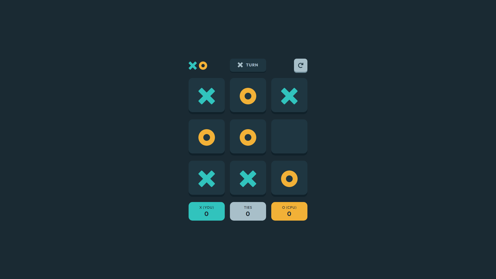

# Frontend Mentor - Tic Tac Toe solution

This is a solution to the [Tic Tac Toe challenge on Frontend Mentor](https://www.frontendmentor.io/challenges/tic-tac-toe-game-Re7ZF_E2v).

## Table of contents

- [Overview](#overview)
  - [The Challenge](#the-challenge)
  - [Screenshot](#screenshot)
  - [Links](#links)
- [My Process](#my-process)
  - [Built With](#built-with)
  - [What I Learned](#what-i-learned)

## Overview

### The Challenge

Users should be able to:

- View the optimal layout for the game depending on their device's screen size.
- See hover states for all interactive elements on the page.
- Play the game either solo vs the computer or multiplayer against another person.
- **Bonus 1 (Done!)**: Save the game state in the browser so that it’s preserved if the player refreshes their browser.
- **Bonus 2 (Done!)**: Instead of having the computer randomly make their moves, try making it clever so it’s proactive in blocking your moves and trying to win.

### Screenshot

### Links

- [Solution](https://www.frontendmentor.io/solutions/impossible-ai-local-storage-no-frameworks-VDkgPghH5d)
- [Live Site](https://frontend-mentor-tic-tac-toe-26071997.netlify.app/)

## My Process

### Built With

- HTML
- SCSS
- JS

### What I Learned

- The minimax algorithm functionality.
- Utilizing the local storage and handling more complex functions with vanilla JS.
- Designing with utility-based classes.
